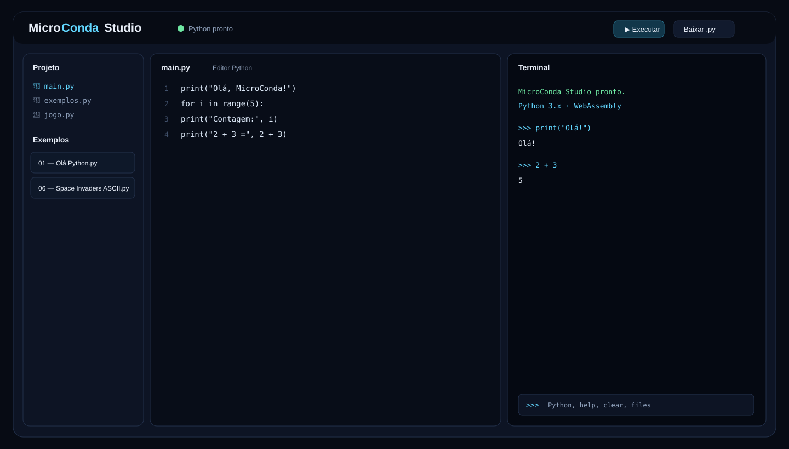
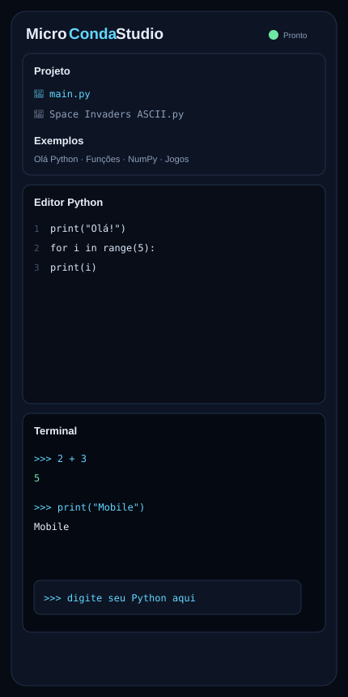
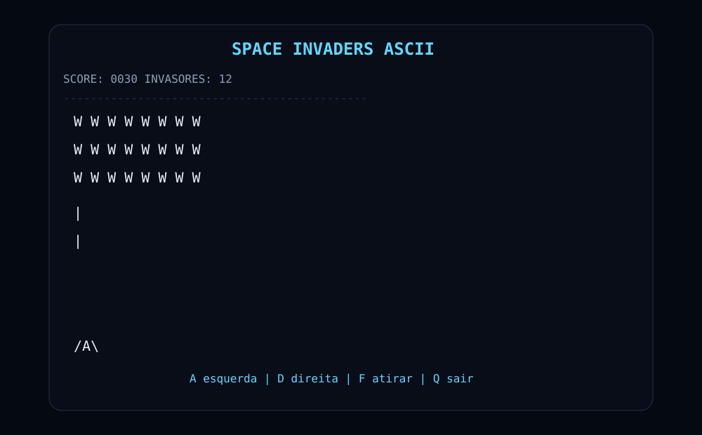

# MicroConda Studio

<div align="center">


# MicroConda

**Um ambiente Python leve e educativo, direto no navegador.**

[**Abrir MicroConda Studio**](https://thiagollipe-web.github.io/microconda/)

</div>

---

## Visão geral

O MicroConda Studio transforma o navegador em um pequeno ambiente de desenvolvimento Python. A proposta é permitir que o usuário escreva, execute e organize código sem instalar um IDE tradicional.

O projeto utiliza **Pyodide/WebAssembly** para executar Python no navegador e possui uma interface responsiva pensada para desktop e celular.

## O que já existe

- Editor Python com numeração de linhas.
- Modo gráfico com canvas HTML5 para jogos Python.
- Suporte integrado a `pygame-ce` no navegador.
- Terminal REPL integrado.
- Execução com Ctrl + Enter.
- Projetos com múltiplos arquivos .py.
- Persistência local do projeto no navegador.
- Criação de novos arquivos.
- Exemplos prontos de Python.
- Download de arquivos .py.
- Exportação do projeto em JSON.
- Histórico de comandos do terminal.
- Comandos help, clear, version, files e load(...).
- Instalação de pacotes Python compatíveis via micropip.
- Exemplo de Space Invaders ASCII executado pelo terminal.
- Interface responsiva para telas menores.
- Logo e identidade visual próprias.

## Como o projeto funciona

```text
┌──────────────────────────────┐
│       MicroConda Studio      │
├───────────┬──────────┬───────┤
│ Projeto   │ Editor   │Terminal│
│ arquivos  │ Python   │ REPL   │
└───────────┴─────┬────┴───────┘
                  │
                  ▼
          Pyodide / WebAssembly
                  │
                  ▼
             Python no browser
```

O aplicativo é essencialmente client-side: o código Python é enviado ao runtime Pyodide dentro do navegador.

## Interface desktop



## Interface mobile



## Exemplo: Space Invaders ASCII

Um dos testes do ambiente é um pequeno jogo ASCII escrito em Python. Ele demonstra que o terminal pode executar lógica de jogo além de scripts simples.



Controles:

```text
A = esquerda
D = direita
F = atirar
Q = sair
```

## Jogos Python no navegador

O Studio possui um **Modo Jogo** separado do Terminal. Ao clicar em **🎮 Executar jogo**, o código atual é executado no canvas gráfico.

Para jogos 2D em Python, o caminho principal é **pygame-ce**. O Pyodide atual disponibiliza `pygame-ce` como pacote integrado, e a API de canvas permite direcionar a saída SDL para um elemento HTMLCanvasElement. Consulte a [documentação do Pyodide sobre pacotes](https://pyodide.org/en/stable/usage/packages-in-pyodide.html) e [SDL/Pygame no navegador](https://pyodide.org/en/0.29.4/usage/sdl.html).

Exemplo mínimo:

```python
import asyncio
import pygame

async def main():
    pygame.init()
    tela = pygame.display.set_mode((640, 360))
    rodando = True

    while rodando:
        for evento in pygame.event.get():
            if evento.type == pygame.QUIT:
                rodando = False

        tela.fill((10, 20, 40))
        pygame.display.flip()
        await asyncio.sleep(1 / 60)

    pygame.quit()

await main()
```

**Importante:** no navegador, um `while True` ou outro loop infinito que nunca cede o controle pode bloquear a atualização da página. Para animações contínuas, use um loop assíncrono com `await asyncio.sleep(...)`.

O botão **■ Parar** envia um sinal de parada e o Studio injeta um evento `pygame.QUIT`; isso funciona quando o jogo processa `pygame.event.get()` e o loop continua cedendo o controle ao navegador.

## Navegador e persistência

O MicroConda roda no navegador com **Pyodide/WebAssembly** e salva o projeto em **LocalStorage** deste navegador.

O runtime Python depende do carregamento do Pyodide pela CDN oficial usada no projeto. Portanto, a aplicação não promete execução Python totalmente offline em uma nova sessão.


## Testar

Acesse: **https://thiagollipe-web.github.io/microconda/**

No celular, abra o endereço diretamente no navegador. A interface se adapta ao tamanho da tela. O modo jogo utiliza o mesmo painel gráfico.

## Estrutura principal

```text
microconda/
├── index.html
├── icons/
│   └── microconda.svg
├── docs/
│   └── screenshots/
│       ├── microconda-studio-desktop.svg
│       ├── microconda-studio-mobile.svg
│       └── space-invaders-ascii.svg
├── space_invaders_ascii.py
├── .github/
│   └── workflows/
│       └── validate.yml
├── sw.js              # limpeza de instalações/cache PWA legados
└── LICENSE
```

## Tecnologias

| Tecnologia | Função |
|---|---|
| HTML5 | Interface |
| CSS3 | Layout responsivo |
| JavaScript | IDE, terminal e integração |
| Python | Linguagem executada |
| Pyodide | Python via WebAssembly |
| LocalStorage | Persistência local |

## Estado do projeto

O projeto está em evolução, com foco em um Python Studio educacional e mobile-first. A instalação PWA e o botão de instalação foram removidos; o arquivo `sw.js` permanece apenas como rotina de limpeza para instalações antigas.

## Licença

Este projeto mantém a licença presente no arquivo LICENSE.

<div align="center">
**MicroConda Studio · Python no navegador**
</div>